# Proyecto_EDA_Python  
**The Power - Proyecto 4**

## 🎯 Objetivo del proyecto

Este proyecto consiste en realizar un análisis exploratorio sobre datos de campañas de marketing telefónico realizadas por un banco portugués, con el fin de comprender mejor el perfil de los clientes y el rendimiento de las campañas.

## 📁 Estructura del repositorio

Ruta: https://github.com/Sebastien732/Proyecto_EDA_Python.git

- `datos/`: Contiene los datasets originales (`CSV` y `Excel`) y los datos transformados.
- `notebooks/`: Archivos Jupyter Notebook con el desarrollo del análisis y gráficos de ilustración del fichero README.
- `scripts/`: Código auxiliar para limpieza y transformación.
- `README.md`: Documento explicativo del proyecto y hallazgos.

```
📁 Proyecto_EDA_Python
├─ README.md
├─ 📁 datos/
│   ├─ bank-additional.csv
│   ├─ customer-details.xlsx
│   └─ df_bank_cust.csv
├─ 📁 notebooks/
│   └─ exploracion.ipynb
└─ 📁 scripts/
    └─ limpieza_transformacion.py
```

## 🛠 Herramientas utilizadas

- Python
- Pandas
- Seaborn
- Matplotlib
- Numpy
- Sklearn.linear_model
- Jupyter Notebook
- Visual Studio Code

## 🗂 Fuente de datos

- `bank-additional.csv`: Detalles sobre interacciones en campañas de marketing.
- `customer-details.xlsx`: Información demográfica y de comportamiento de clientes.
- `df_bank_cust.csv`: Data frame final obtenido tras limpieza y transformación de los datos anteriores.

## 🗂 Descripción de los datos brutos

### 'bank-additional.csv':
- **age:** Edad del cliente.
- **job:** Ocupación o profesión del cliente.
- **marital:** Estado civil del cliente.
- **education:** Nivel educativo del cliente.
- **default:** Indica si el cliente tiene historial de incumplimiento de pagos (1: Sí, 0: No).
- **housing:** Indica si el cliente tiene un préstamo hipotecario (1: Sí, 0: No).
- **loan:** Indica si el cliente tiene algún otro tipo de préstamo (1: Sí, 0: No).
- **contact:** Método de contacto utilizado para comunicarse con el cliente.
- **duration:** Duración en segundos de la última interacción con el cliente.
- **campaign:** Número de contactos realizados durante esta campaña para este cliente.
- **pdays:** Número de días desde la última vez que se contactó al cliente durante esta campaña.
- **previous:** Número de veces que se ha contactado al cliente antes de esta campaña.
- **poutcome:** Resultado de la campaña de marketing anterior.
- **emp.var.rate:** Tasa de variación del empleo.
- **cons.price.idx:** Índice de precios al consumidor.
- **cons.conf.idx:** Índice de confianza del consumidor.
- **euribor3m:** Tasa de interés de referencia a tres meses.
- **nr.employed:** Número de empleados.
- **subscribed:** Indica si el cliente ha suscrito un producto o servicio (Sí/No). (Columna renombrada desde 'y')
- **date:** Fecha en la que se realizó la interacción con el cliente.
- **latitude:** Coordenadas de latitud de la ubicación del cliente.
- **longitude:** Coordenadas de longitud de la ubicación del cliente.
- **contact_month:** Mes en el que se realizó la interacción con el cliente durante la campaña de marketing.
- **contact_year:** Año en el que se realizó la interacción con el cliente durante la campaña de marketing.
- **id_:** Identificador único para cada registro en el dataset.

### 'customer-details.xlsx'
- **Income:** Ingreso anual del cliente en términos monetarios.
- **Kidhome:** Número de niños en el hogar del cliente.
- **Teenhome:** Número de adolescentes en el hogar del cliente.
- **Dt_Customer:** Fecha en que el cliente se convirtió en cliente de la empresa.
- **NumWebVisitsMonth:** Cantidad de visitas mensuales del cliente al sitio web de la empresa.
- **ID:** Identificador único del cliente.

## ✅ Pasos realizados

### 1. Carga de datos desde archivos `.csv` y `.xlsx`
- El archivo `bank-additional.csv` está asignado a la variable `bank_df`.
- Las páginas del archivo `customer-details.xlsx` están asignadas a las variables `customer_df_2012`, `customer_df_2013` y `customer_df_2014`.

### 2. Inspección inicial de los archivos
Se realizó una inspección preliminar de ambos archivos utilizando los siguientes métodos de análisis:
```python
.sample(), .shape(), .columns(), .dtypes(), .info(), .isnull(), .sum(), .describe()
```

#### Análisis del DataFrame `bank_df`
- El DataFrame `bank_df` contiene **43,300 entradas** y **24 columnas**.
- Las columnas Latitude y Longitude no constaban en la descripción original y la fecha de contacto aparece en una sola columna, no separada en columnas individuales por día, mes y año. Se actualizó la descripción y se convirtió la columna fecha en 3 columnas.
- Se detectaron tipos de datos incorrectos en algunas columnas, los cuales serán detallados y corregidos en la siguiente etapa.
- Se observaron valores nulos significativos en las columnas `age`, `default` y `euribor3m`, representando entre el 10% y el 20% del total de los datos.
- Se propone:
  - **Rellenar los valores faltantes** en las columnas con alta proporción de nulos.
  - **Eliminar filas** con menos del **5% de valores nulos**, para mantener la calidad del conjunto de datos.

#### Análisis de los DataFrames `customer_df_2012`, `customer_df_2013` y `customer_df_2014`
- Los tres DataFrames presentan la misma estructura de datos, lo que permite su **unificación** en una sola tabla para facilitar la limpieza y transformación en etapas posteriores. Los 3 DataFrames combinados contienen **43,170 entradas** y **7 columnas**.
- No se encontraron valores nulos en ninguno de los tres DataFrames.
- Los tipos de datos en cada columna están correctamente alineados con los valores que contienen.

#### Relación entre `bank_df` y los DataFrames de clientes
- El formato del campo `ID` en `bank_df` y en los DataFrames de clientes es **similar**.
- Se utilizó el método `.isin()` para verificar que los valores de `ID` están presentes en ambos conjuntos de datos.
- Se confirma que el campo `ID` puede ser utilizado como **clave común** para consolidar los DataFrames.

---

### 3. Limpieza y transformación

**Procesos aplicados:** normalización de variables categóricas, tratamiento de fechas, codificación de valores booleanos.

#### Tratamiento de valores faltantes
- En la columna `age`, aproximadamente el **12% de los valores están ausentes**. Dado que esta variable es crucial, no se eliminan las filas. En su lugar, se imputan los valores faltantes utilizando la **edad promedio de clientes con perfiles similares**, definidos por los atributos `job` y `education`.
- Se eliminan las filas con valores faltantes en las columnas `job`, `marital`, `housing`, `loan` y `date`, ya que representan **menos del 3% del DataFrame**.
- Para la columna `education`, los valores faltantes se reemplazan por el valor `"unknown"`.

#### Observaciones adicionales
- Al revisar una muestra del DataFrame, se detecta una posible **correspondencia entre los valores únicos** de las columnas `cons.price.idx` y `cons.conf.idx`.
- Se confirma esta relación y se procede a **rellenar los valores faltantes en `cons.price.idx`** utilizando los valores correspondientes de `cons.conf.idx`.
- No se observan outliers en las columnas numéricas.

### 🔍 Análisis de valores nulos en la columna `euribor3m`
Se han detectado valores nulos en la columna `euribor3m`, que representan **más del 20%** del total de registros disponibles. Dado este volumen significativo de datos faltantes, se considera adecuado aplicar técnicas de imputación para estimar dichos valores.

Tras evaluar distintos métodos —**media**, **mediana**, **moda** y un **modelo de regresión lineal**— se opta por este último. La decisión se basa en la **fuerte correlación** observada entre `euribor3m` y `emp.var.rate`, con un coeficiente de **0.9724**, lo que sugiere que el modelo de regresión puede proporcionar estimaciones precisas y coherentes.

#### Correlaciones con Euribor 3M
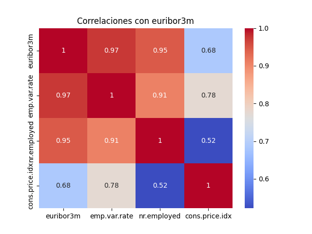

---

#### 🛠️ Transformación de tipos de datos

Durante la fase de exploración de datos se identificaron varias columnas con tipos incorrectos. Se realizaron las siguientes transformaciones:

| Columna         | Tipo original | Tipo corregido |
|-----------------|--------------|---------------|
| `age`           | float64       | int           |
| `default`       | float64       | bool          |
| `housing`       | float64       | bool          |
| `loan`          | float64       | bool          |
| `cons.price.idx`| object        | float         |
| `cons.conf.idx` | object        | float         |
| `euribor3m`     | object        | float         |
| `nr.employed`   | object        | int (formato uniforme) |
| `y` → `subscribed` | object    | bool          |
| `date`          | object        | datetime      |

> Las columnas `contact`, `duration`, `campaign`, `pdays`, `previous`, `poutcome`, `emp.var.rate`, `latitude`, `longitude`, `id_` mantienen sus tipos originales.

---

#### 🧹 Limpieza y ajustes adicionales

- En la columna `age`, los valores nulos fueron reemplazados por el promedio calculado según las variables `job` y `education`.
- En `pdays`, el valor `999` representa clientes no contactados. Este valor fue reemplazado por `NaN` para excluirlo de cálculos estadísticos.
- En las columnas `cons.price.idx`, `cons.conf.idx` y `euribor3m`, se reemplazaron las comas por puntos antes de convertir los valores a tipo `float`.
- En `nr.employed`, se uniformizó el formato para obtener valores de 5 dígitos con un decimal.
- La columna `y` fue renombrada a `subscribed`, transformando `"yes"` en `True` y `"no"` en `False`, y cambiando su tipo a `bool`.
- En `date`, se tradujeron los nombres de los meses a números mediante un diccionario, y se convirtió la columna al formato `datetime` (`dd-mm-aa`). Se añadieron las columnas `contact_month` y `contact_year`, presentes en la descripción original pero ausentes en el archivo CSV.
- En `dt_Customer` se simplificó la fecha a mes-año para mejor lectura y visualización posterior.

---

#### 🔗 Combinación de DataFrames

- Se combinaron verticalmente los tres DataFrames de clientes en uno nuevo llamado `df_customer_combinados`.
- La columna `Dt_Customer` fue convertida al formato de fecha `dd-mm-aa`.
- Finalmente, se fusionaron los DataFrames `bank_df` y `df_customer_combinados` usando la columna `ID` como clave común, generando el DataFrame final `df_bank_cust`, con **42,332 registros y 29 columnas**.
> Durante este proceso se perdieron 170 registros del DataFrame de clientes, correspondientes a personas que no participaron en la campaña analizada.
- Se reinició el índice y se eliminaron las columnas innecesarias como `'ID'`, `'_id'` y el índice original de `customer_df`.

---

#### 💾 Exportación del DataFrame final

Tras la limpieza y transformación de los datos, se exportó el DataFrame final `df_bank_cust` a un archivo `.CSV` para su posterior análisis.


---


4. ## Análisis de suscripción: suscriptores vs. no suscriptores

_(desde df_bank_cust.csv)_

Este análisis tiene como objetivo identificar los factores que influyen en el éxito de la campaña de marketing bancario, comparando las características de los clientes que se han suscrito frente a los que no lo han hecho.

La campaña, desarrollada entre enero de 2015 y diciembre de 2019, logró una tasa de éxito del 11,25 % sobre el total de clientes contactados, lo que constituye un indicador relevante de su rendimiento global.

De primero se observa la distribución general de los datos con graficas y posibles outliers con boxplot pero solo se comentaran dentro de las siguientes categoría en el caso que tengan un interés en la analisis.

## 🎂 Edad

La mayoría de las personas tienen entre 30 y 45 años, donde se concentra la mayor frecuencia de clientes

El 25% de los datos tienen menos de 33 años, 50% menos de 38 años y el 75% menos de 45 años.

Observamos que la Media (39.8 años) y la Moda (40 años) están muy cerca, lo que indica una distribución bastante centrada.

Los suscritos parecen estar más concentrados en el rango de 35 a 45 años pero al contrario observamos que la tasa de éxito es mayor por las poblaciones de menos de 30 años y de mas de 55

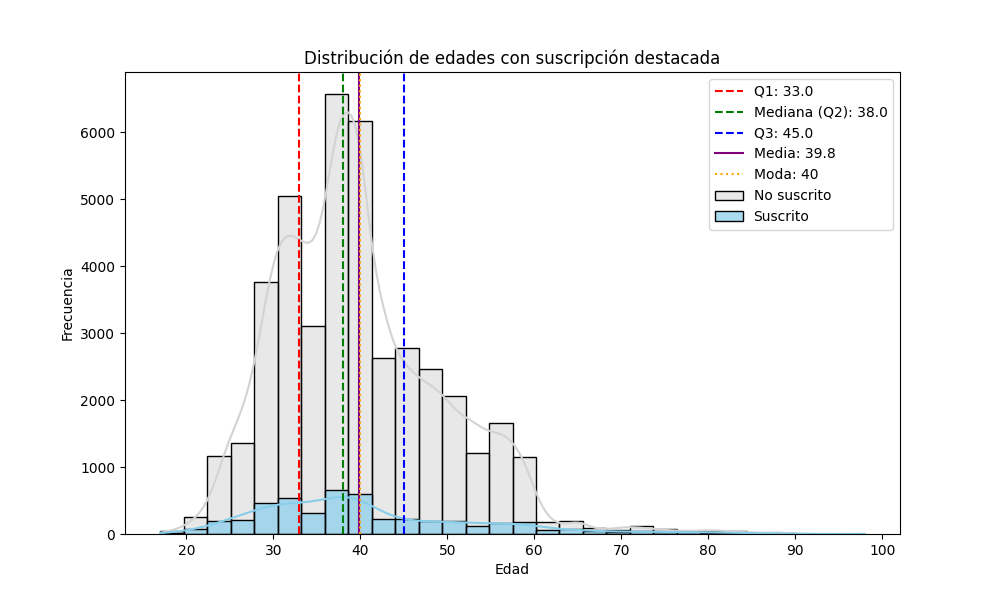

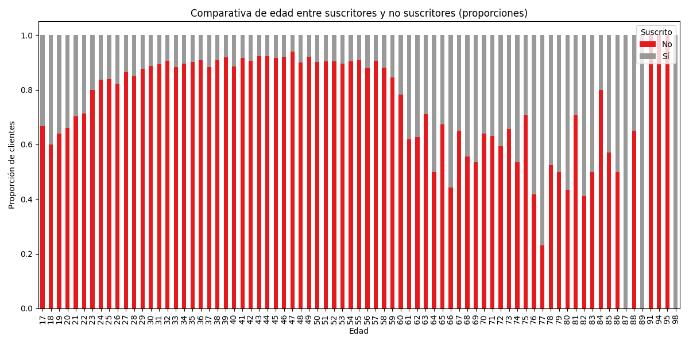

## 👔 Ocupación

De primero observamos que los  principales tipos de ocupacion de los clientes son empleos de administración, trabajos manules (blue collar) y puestos técnicos.

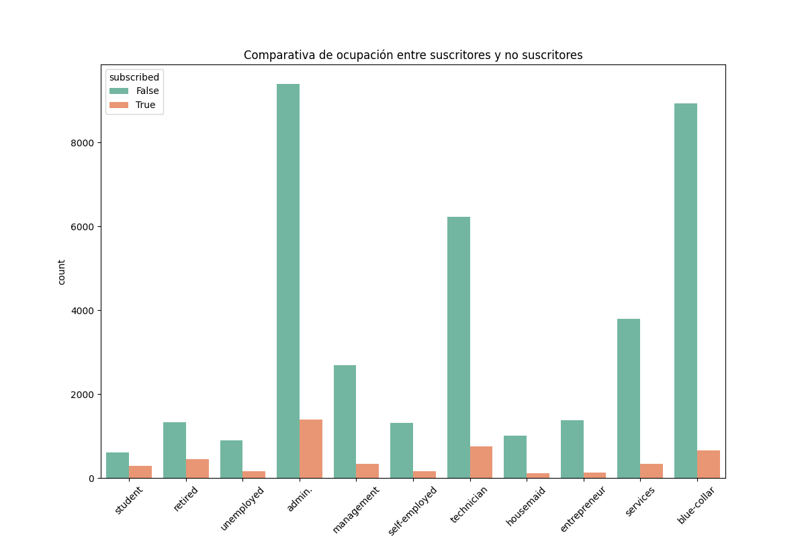

La tendencia observada en la edad se confirma al analizar la ocupación. Estudiantes y jubilados presentan las tasas más altas de suscripción.

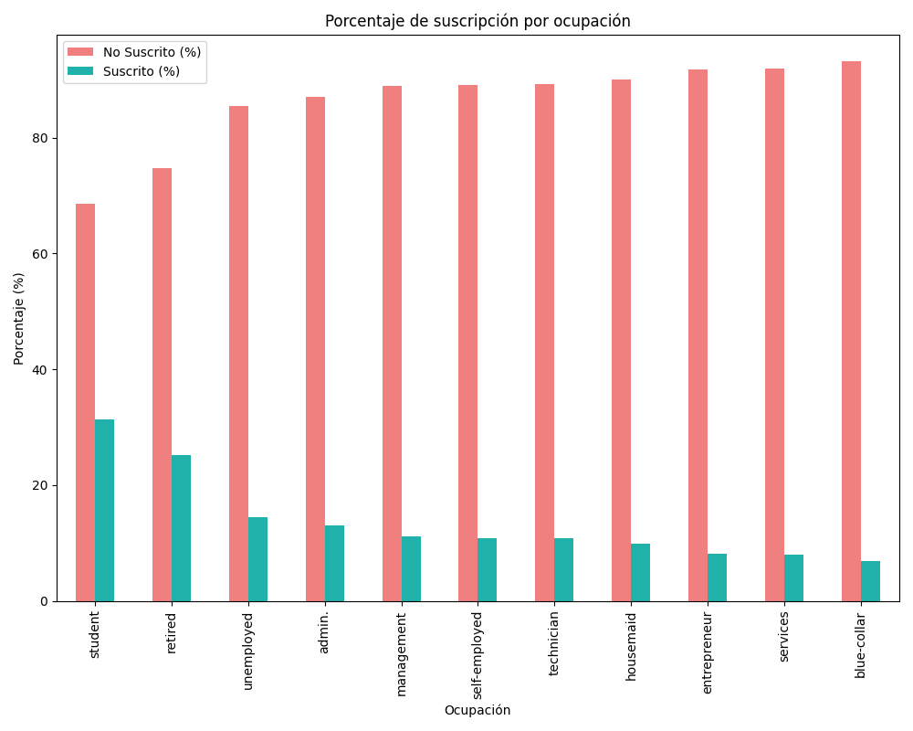

## 💍 Estado civil

Los clientes solteros muestran una ligera ventaja en la tasa de suscripción respecto a otras categorías.

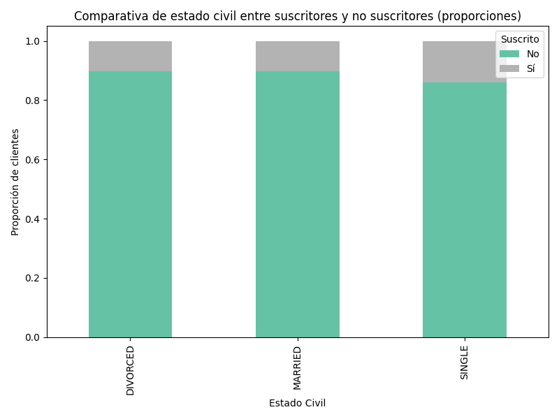

## 🎓 Nivel educativo

El perfil de educación de los cliente general nos muestra que mas del 50% de los cliente tienen un nivel universitario o de instituto.

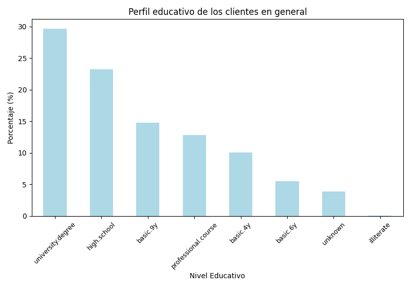

Excluyendo los casos con nivel educativo desconocido, se observa un mayor éxito en los clientes con educación universitaria y también entre los iletrados.

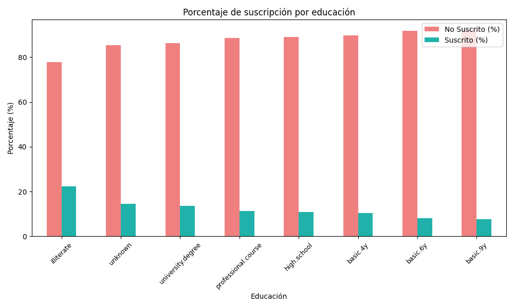

## 💳 Historial de impago

Los clientes sin incidencias de pago tienen una mayor tasa de suscripción.

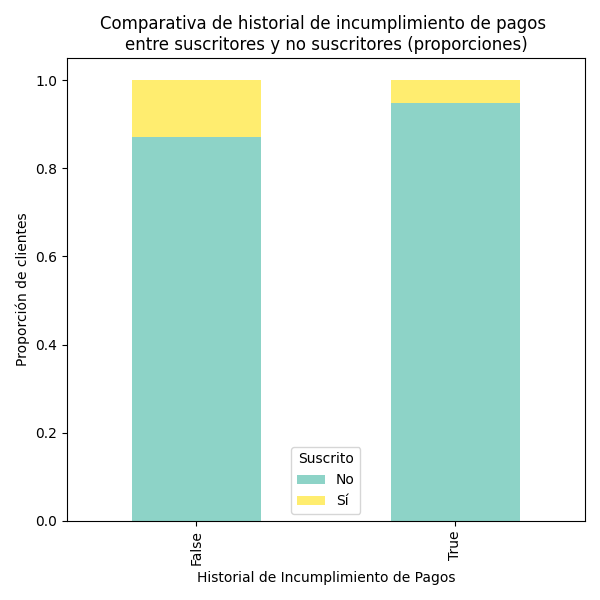

## 🏠 Préstamos hipotecarios y personales

No se observan diferencias significativas entre suscriptores y no suscriptores en relación con la tenencia de préstamos.

Tenencia de préstamos hipotecario: 11.57% de los suscritores tienen hipoteca Vs 10.87% que no tienen.

Tenencia de préstamo personal: 10.91% de los suscritores tienen un préstamo  Vs 11.32% que no tienen.

## ☎️ Método de contacto

El contacto vía teléfono móvil es claramente más efectivo que el contacto por línea fija (14.71% Vs 5.15).

## ⏱️ Duración de la última llamada

Estudiando este data se observa anomalías con llamadas muy cortas. Se sospecha que las llamadas muy cortas representan una falta de contacto real (buzón de voz, cliente no está disponible o cuelga, ect..) en cuento a las llamadas muy largas parecen ser casos excepcionales, pero con una tasa de éxito mayor por lo cual no las podemos descartar aunque parezcan un desperdicio de recursos.

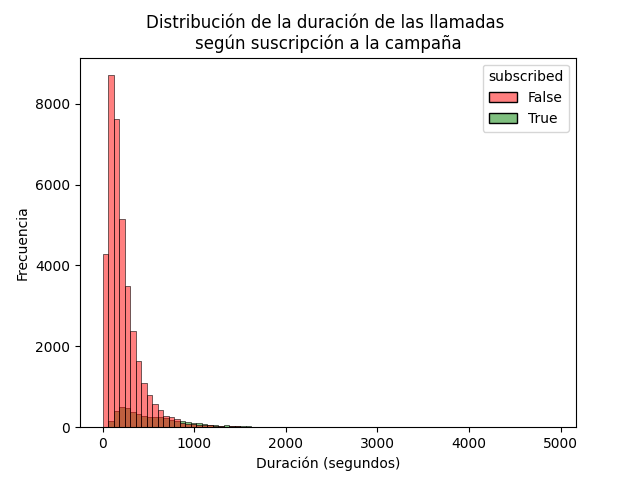

La duración media de la última llamada para todos los clientes es: 257.79 segundos (4.3 minutos)

La duración media de la última llamada para los clientes que han suscrito a la campaña es: 552.54 segundos (9,2 minutos)

La duración media de la última llamada para los clientes que no han suscrito a la campaña es: 220.43 segundo (3,67 minutos)

Las llamadas con éxito a una suscripción tienden a ser el doble más largas.

Sería interesante saber si la duración de clientes suscritores incluye el tiempo para establecer el mismo contrato o confirmar datos.

## 🔁 Número de interacciones durante la campaña

La media general de contactos durante la campaña por cliente es: 2.56

La media de contactos durante la campaña por cliente que han suscrito es: 2.05

La media de contactos durante la campaña por cliente que no han suscrito es: 2.63

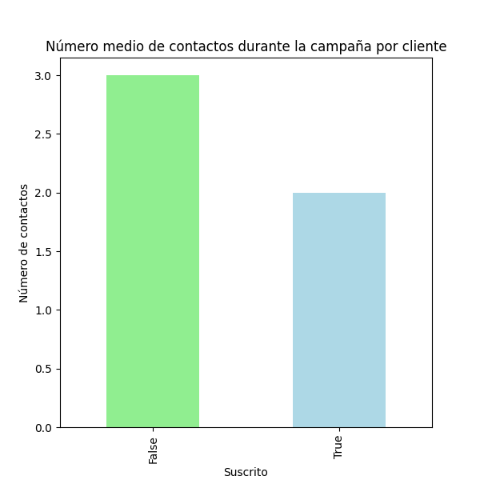

Notamos outliers en esta categoría con clientes contactados hasta 41 vez, estos podrían incluir llamadas con falta de contacto o buzón de voz

Mirando por número exacto de interacciones podemos observar que la tasa de éxito disminuye fuertemente según aumentan los contactos.

Esta grafica resalta esta conclusión agrupando la cantidad de contacto por rango de 5

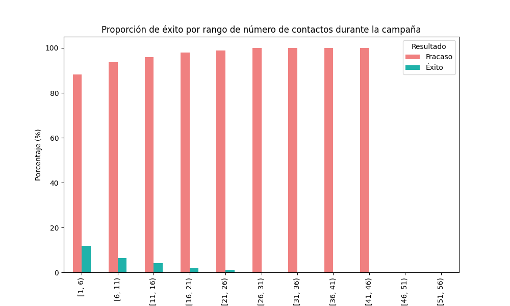

Quedaría aclarar si la categoría “campaign” trata de interacciones reales o solo intentos de llamadas exitosas o no

## 📆 Días desde la última interacción

No se observan diferencias entre suscriptores y no suscriptores.

## 🔁 Número de interacciones previas a esta campaña

Mirando la distribución general de la columna “previous”, observamos que la mayoría de los clientes no fueron contactados antes de esta campaña. Cuando comparamos esta distribución con la tasa de éxito se puede observar claramente un éxito mayor cuando hubo contactos previos.

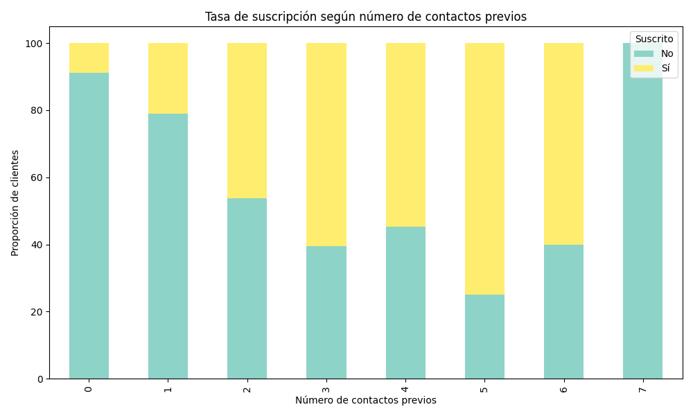

## 📈 Resultados de campañas anteriores

Los clientes que ya habían suscrito en campañas anteriores tienen una probabilidad significativamente mayor de volver a hacerlo. El 65% de los suscriptores actuales ya habían participado en campañas previas.

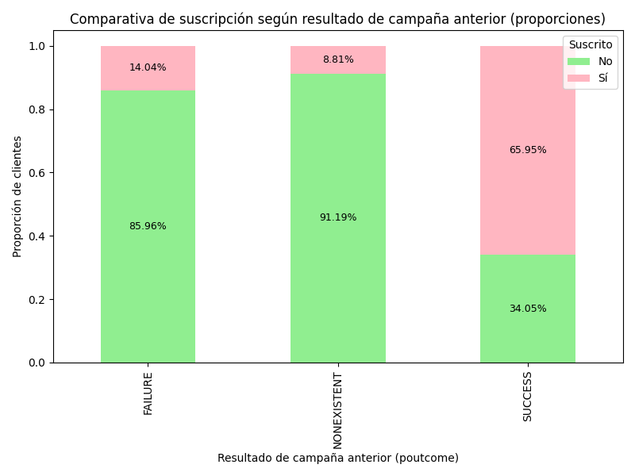

---

# 🗺️ Ubicación geográfica

El mapa de coordenadas no revela focos geográficos significativos de éxito. La distribución de suscriptores es homogénea, lo que sugiere que la ubicación no es un factor determinante.

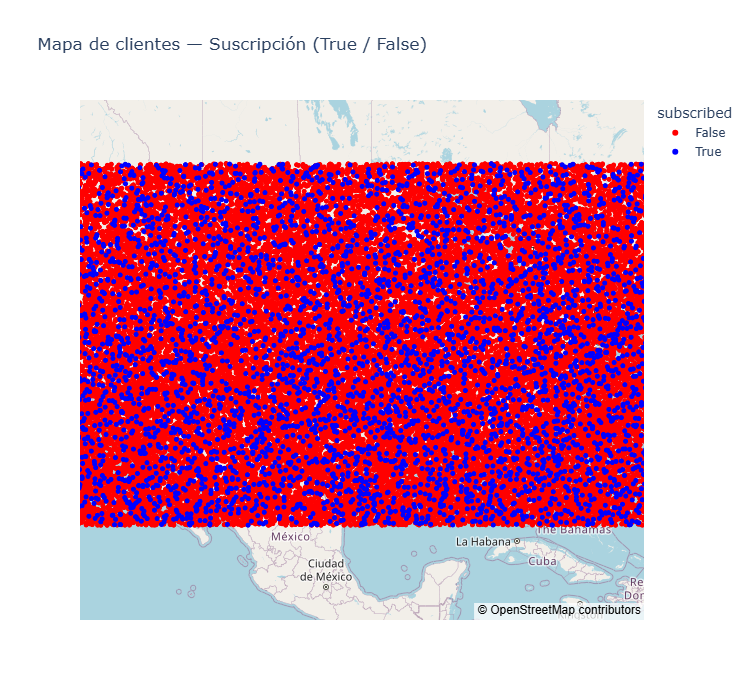

---

# 📊 Otros factores

- **Ingresos anuales**: No se observa una correlación clara.

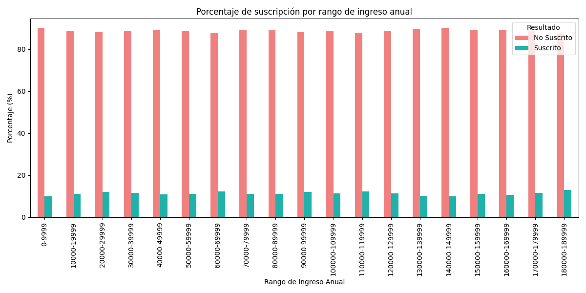

- **Número de hijos**: No hay impacto significativo.

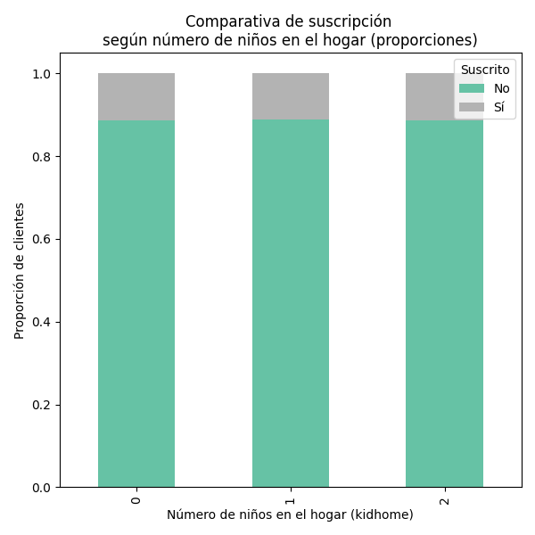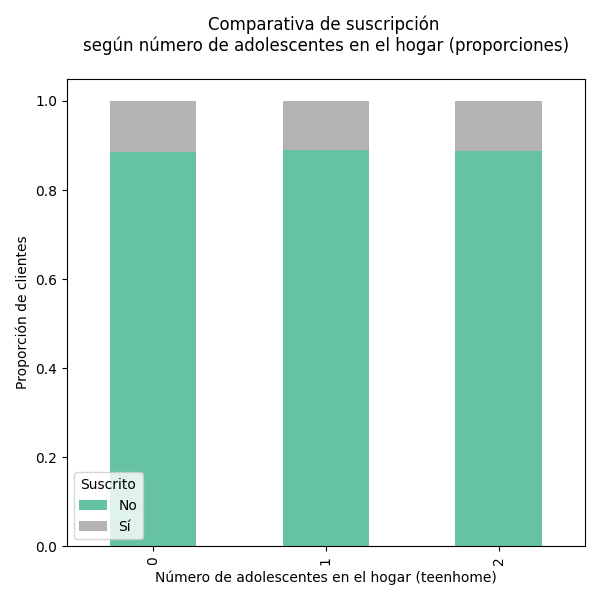

- **Antigüedad del cliente**: Mayor éxito en clientes recientes (desde 2014).

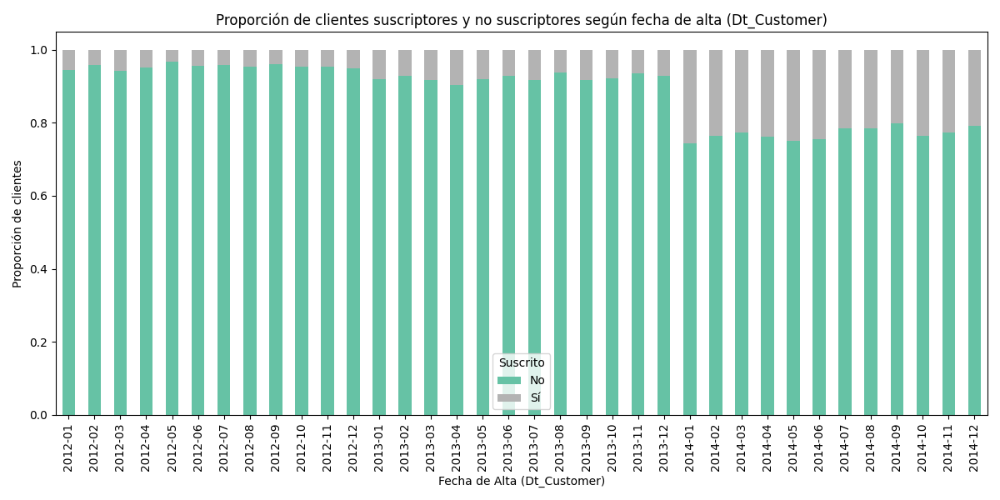

- **Visitas a la web**: No se detecta una relación clara.

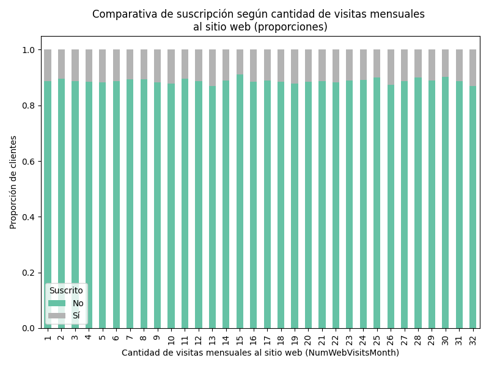

# 💰 Enfoque sobre los parámetros financieros y la temporalidad con las suscripciones

## 📉 Tasa de variación del empleo (`emp.var.rate`)

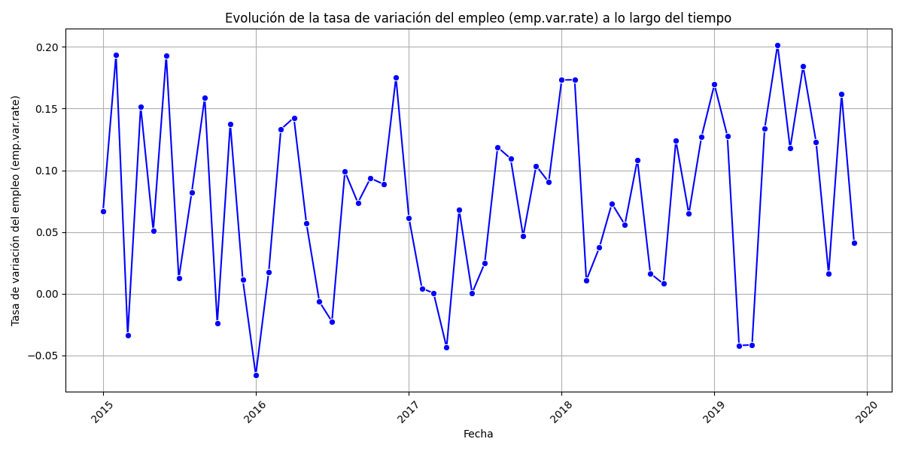

## 🛒 Índice de precios al consumidor (`cons.price.idx`)

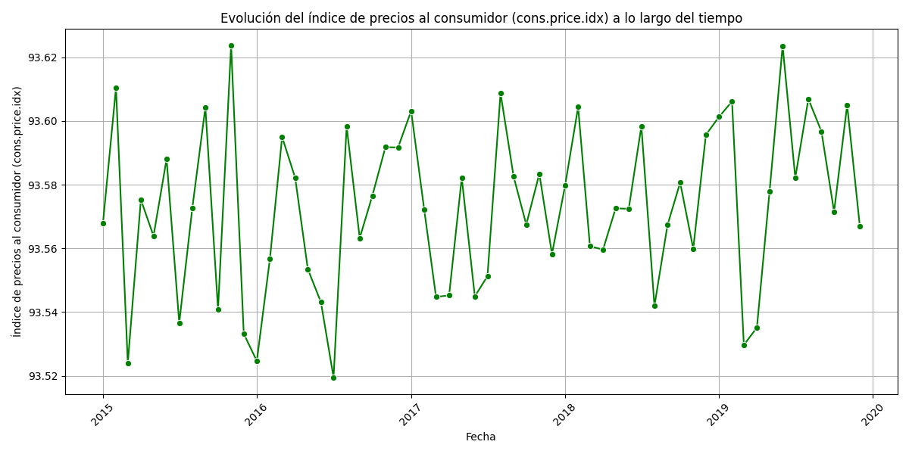

## 📉 Índice de confianza del consumidor (`cons.conf.idx`)

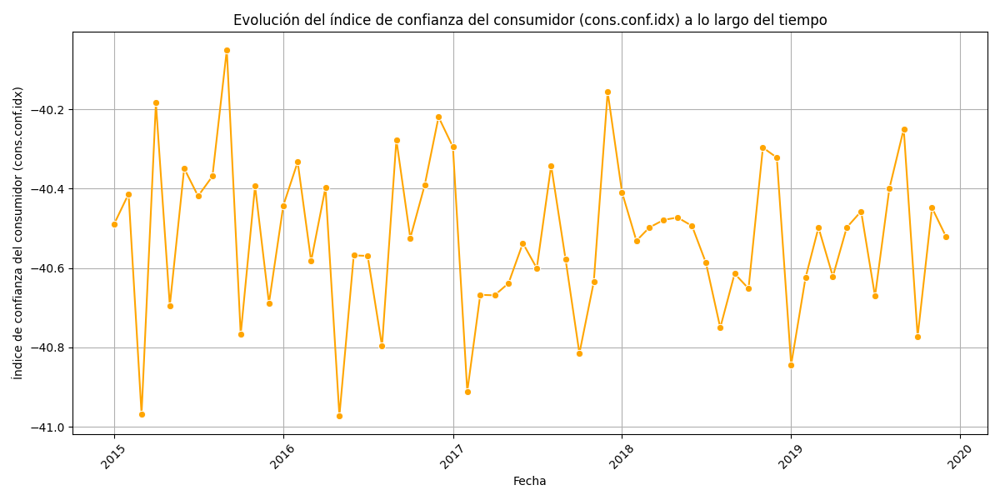

## 💶 Euribor a tres meses (`euribor3m`)

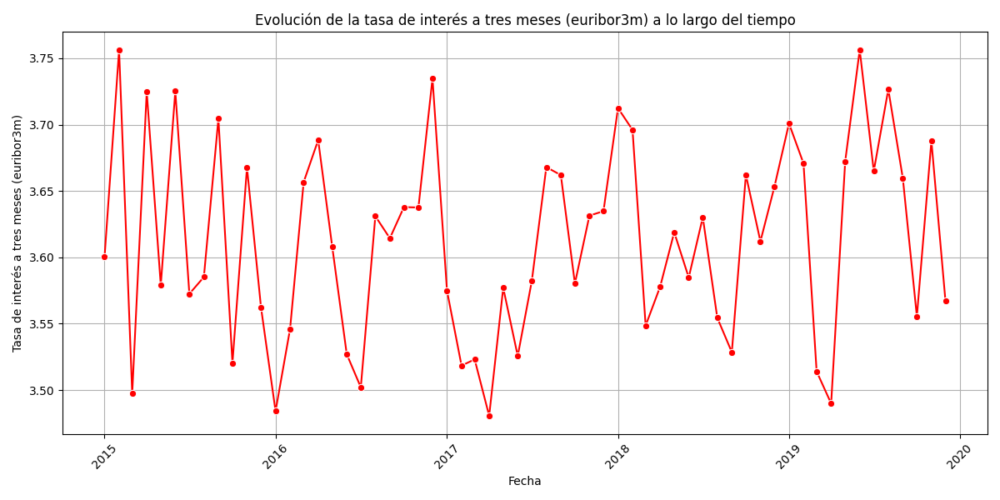

## 👥 Número de empleados

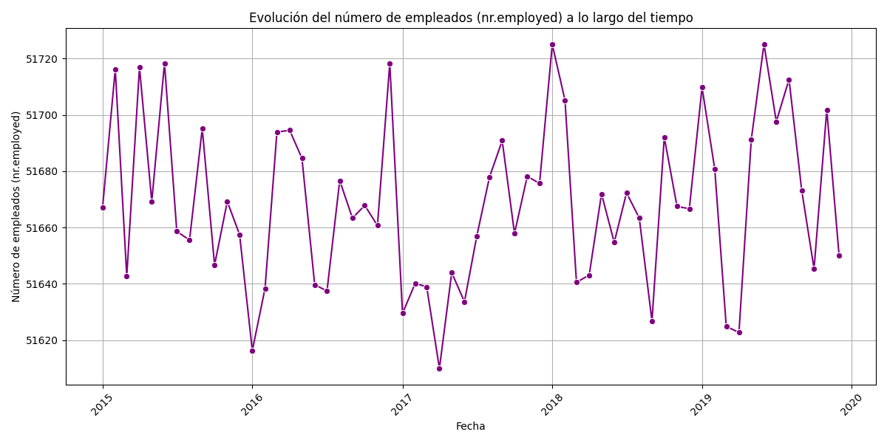

🔥 1. Correlación general (heatmap)

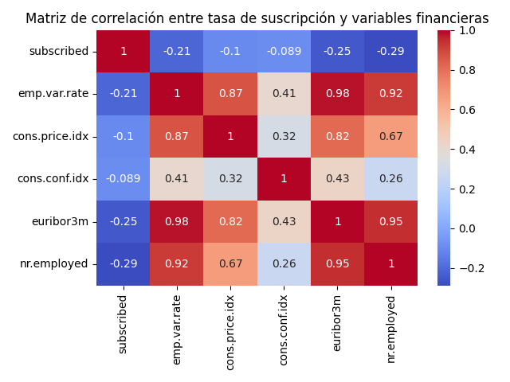

La matriz de correlación muestra lo siguiente:

euribor3m y emp.var.rate tienen una correlación negativa moderada con la tasa de suscripción. Esto sugiere que cuando estas tasas suben, la probabilidad de suscripción baja.

cons.conf.idx tiene una correlación ligeramente positiva, lo que indica que cuando la confianza del consumidor mejora, también lo hace la tasa de suscripción.

cons.price.idx no parece tener una relación significativa.

📈 2. Gráficos de dispersión

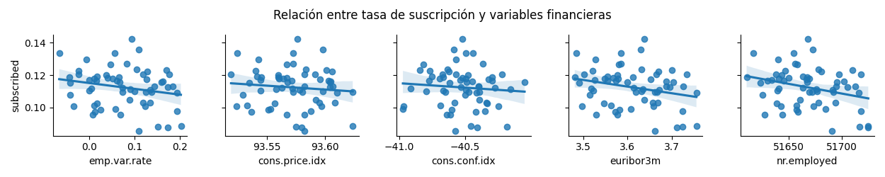

Los scatter plots confirman visualmente lo anterior:

euribor3m: Se observa una pendiente descendente clara. A mayor tasa Euribor, menor tasa de suscripción. Esto tiene sentido: tasas de interés más altas suelen desalentar decisiones financieras como contratar productos bancarios.

emp.var.rate: También muestra una pendiente negativa. Si la variación del empleo es alta (indicando inestabilidad), la gente parece menos propensa a suscribirse.

nr.employed: Aunque podría parecer contraintuitivo, el número de empleados tiene una correlación negativa. Esto puede deberse a que en épocas de empleo alto, los bancos no necesitan campañas agresivas, y por tanto las tasas de suscripción bajan.

cons.conf.idx: La pendiente es ligeramente positiva. Cuando los consumidores se sienten más seguros, están más dispuestos a comprometerse con productos financieros.

cons.price.idx: La nube de puntos es difusa, sin una tendencia clara. No parece haber una relación directa.

---

# 📅 Temporalidad

- **Año**: La tasa de éxito es estable año tras año.

- **Mes**: de forma general el mes de octubre destaca como el mes con mayor proporción de suscriptores.

---


5. ## Conclusiones:
 *hallazgos significativos, propuestas de mejora en las campañas*


## 🧑‍💼Perfil típico del cliente suscriptor
1. Edad

Aunque la mayoría de los clientes tienen entre 30 y 45 años, la tasa de éxito es mayor en los menores de 30 años y en los mayores de 55.
Los suscriptores tienden a concentrarse en el rango de 35 a 45 años, pero los extremos jóvenes y mayores muestran una mayor propensión a suscribirse.

2. Ocupación

Los empleos más comunes entre los clientes son administración, trabajos manuales (blue collar) y técnicos.
Sin embargo, los estudiantes y jubilados presentan las tasas más altas de suscripción.

3. Estado civil

Los clientes solteros muestran una ligera ventaja en la tasa de suscripción respecto a otras categorías.

4. Nivel educativo

Más del 50% de los clientes tienen un nivel universitario o de instituto.
Excluyendo los casos con nivel educativo desconocido, los clientes con educación universitaria y los iletrados presentan mayor éxito de suscripción.

5. Historial de impago

Los clientes sin incidencias de pago tienen una mayor tasa de suscripción.

6. Préstamos

No se observan diferencias significativas entre suscriptores y no suscriptores en relación con la tenencia de préstamos hipotecarios o personales.

7. Método de contacto

El contacto vía teléfono móvil es claramente más efectivo que el contacto por línea fija.

8. Duración de la última llamada

Las llamadas exitosas (que terminan en suscripción) tienden a ser el doble de largas que las que no terminan en suscripción.
La duración media de la última llamada para suscriptores es de 552 segundos (9,2 minutos).

9. Número de interacciones

Los clientes suscriptores suelen requerir menos contactos durante la campaña (media de 2,05) que los no suscriptores (media de 2,63).
La tasa de éxito disminuye fuertemente según aumentan los contactos.

10. Contactos previos y campañas anteriores

Los clientes que han sido contactados previamente o que ya habían suscrito en campañas anteriores tienen una probabilidad significativamente mayor de volver a suscribirse.

11. Ubicación geográfica

No se detectan focos geográficos significativos; la distribución de suscriptores es homogénea.

12. Otros factores

Ingresos anuales: No se observa una correlación clara.
Número de hijos: No hay impacto significativo.
Antigüedad del cliente: Mayor éxito en clientes recientes (desde 2014).
Visitas a la web: No se detecta una relación clara.


Resumen del perfil típico
El cliente suscriptor típico es una persona joven (menos de 30) o mayor (más de 55), estudiante o jubilado, soltero, con educación universitaria o sin estudios, sin historial de impago, contactado preferentemente por móvil, que responde positivamente tras pocas interacciones y que, si ya ha participado en campañas anteriores, tiene más probabilidad de volver a suscribirse. La ubicación y los ingresos no son factores determinantes.


---

# ✅Recomendaciones para futuras campañas para maximizar la tasa de éxito de suscripción

- Se recomienda segmentar la base de clientes y enfocar los esfuerzos en los grupos que históricamente han mostrado mayor tasa de éxito, como jóvenes menores de 30 años, personas mayores de 55 años, estudiantes, jubilados, solteros y clientes con educación universitaria o sin estudios.
- Es aconsejable priorizar el contacto a través de teléfono móvil, ya que este canal ha demostrado ser significativamente más efectivo que la línea fija.
- Resulta conveniente asegurar que las llamadas sean lo suficientemente largas para establecer una conversación real, evitando aquellas demasiado breves que suelen corresponder a contactos fallidos. Las llamadas exitosas suelen tener una duración considerablemente mayor.
- Se sugiere limitar el número de intentos de contacto por cliente, ya que la tasa de éxito disminuye cuando se realizan demasiados intentos. Es preferible priorizar la calidad sobre la cantidad de interacciones.
- Se debe dar prioridad a los clientes que han sido contactados previamente o que ya han suscrito en campañas anteriores, pues presentan una mayor probabilidad de volver a suscribirse.
- Mantener la base de datos de clientes actualizada y depurada contribuye a evitar contactos innecesarios y mejora la segmentación.
- Es recomendable enfocar las campañas en clientes recientes, quienes muestran una mayor propensión a suscribirse.
- Factores como la ubicación geográfica, los ingresos anuales, el número de hijos o las visitas a la web no presentan una correlación significativa con la tasa de éxito, por lo que no se recomienda priorizarlos en la segmentación.
- Se aconseja analizar periódicamente los resultados de la campaña y ajustar la estrategia según los perfiles que estén respondiendo mejor.
- La capacitación de los agentes de telemarketing es fundamental para que puedan identificar rápidamente el perfil del cliente y adaptar el discurso según las características que aumentan la probabilidad de éxito.

---


## 📌 Nota
Este proyecto está diseñado como un ejercicio académico dentro del módulo *Python for Data*. El objetivo es aplicar conocimientos prácticos en la manipulación y análisis de datos.

---
